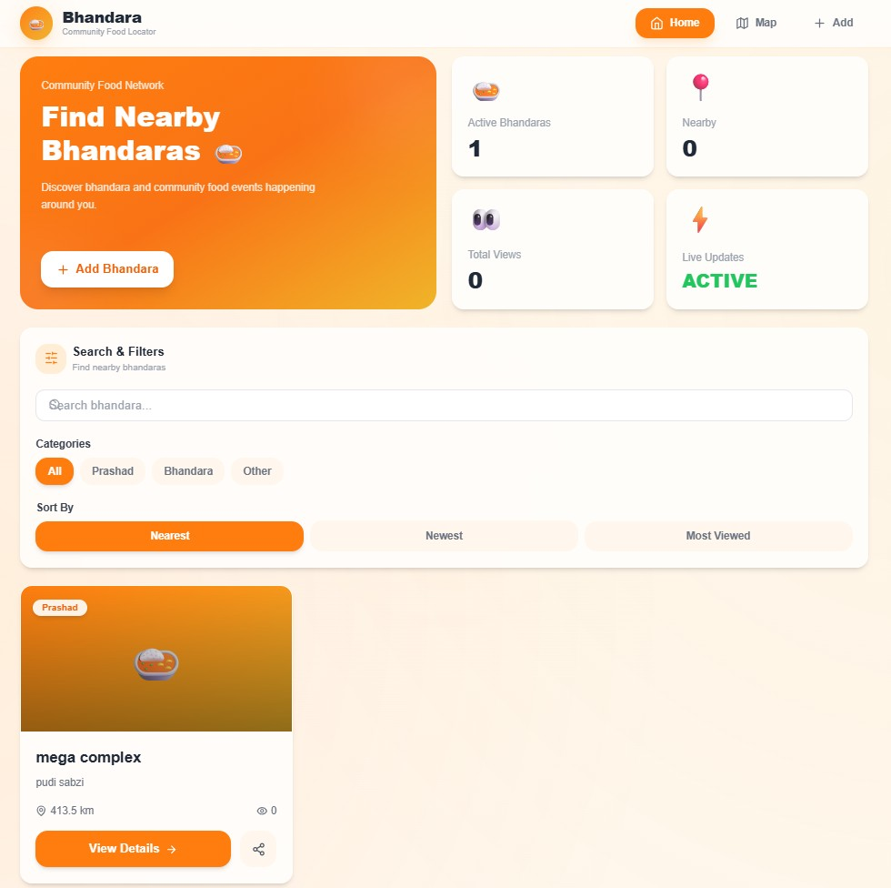
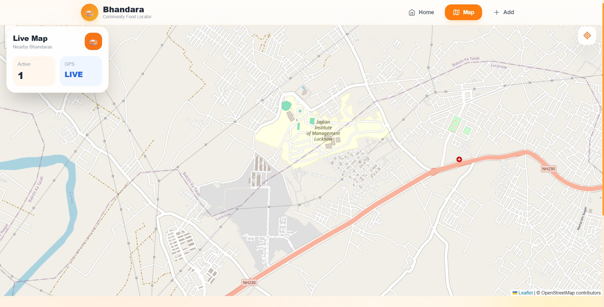
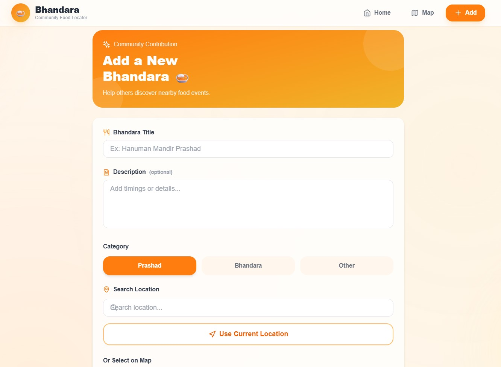
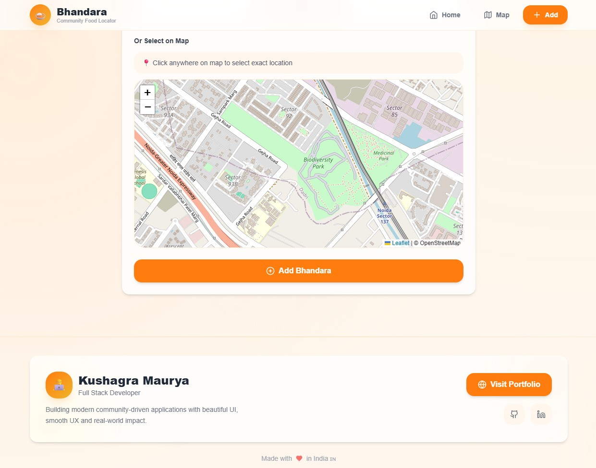

# 🍛 Bhandara Live

### Real-time community food discovery platform

Bhandara Live helps people discover nearby **Bhandaras**, **Prashad distribution**, and community food services through a modern live-map experience.

Built with a focus on:

* real-time accessibility
* clean mobile-first UI
* live location interaction
* community support

---

## ✨ Highlights

* 📍 Live nearby discovery
* 🗺 Interactive map experience
* 🎯 Auto current-location tracking
* 📱 Mobile optimized
* ⚡ Fast and lightweight
* 🔥 Firebase powered backend
* 🍛 Community-driven food updates

---

## 📸 Preview

### 🏠 Home Page UI

---

### 🗺 Live Map UI

---

### 📍 Add Bhandara Details Page UI

---

## ⚙️ Built With

* React
* Vite
* Firebase
* Tailwind CSS
* Leaflet Maps
* React Router

---

## 🌍 Live Project

🚀 https://live-bhandara.netlify.app

---

## 👨‍💻 Developer

Kushagra Maurya

Passionate about building impactful digital experiences combining technology, design, and community utility.

---

## ⭐ Project Vision

Making community food services easier to discover and accessible in real time.
